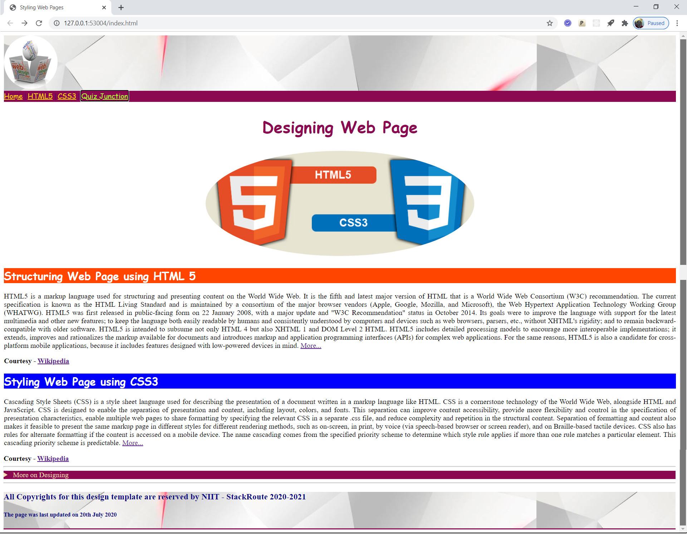

# Sprint 1 - Practice 3
***Build and Deploy an HTML 5 Application -> Adding styles to Web pages***

## Objective
**To design web document providing information about usage of HTML5 and CSS3 in Web Page Design**

### Expected Outcome

Follow the template shown below for designing the web page

### Design Requirements

- The page should be designed based on Web 2.0 standards using semantic HTML5 elements and CSS style properties
- Page should have a meaningful title
- This practice is an extension to Practice 2
- Based upon the template shared, each element on the page has to be styled using CSS style properties
- Header and Footer although different elements, but should be styled using same style rules
- The template shows that both header and footer are styled using the same background image
- Use CSS properties to size, align and apply rounded border to the image in the main section
- The navigation link text color should change when the link is hovered and when clicked.
- The paragraphs in the main section should be justified on both sides
- Highlight the aside element with a different color to make it distinctly displayed

### Design Guidelines

- Across all sections of page, harmony in terms of color, font, spacing and alignment should be maintained
- Page should not allow horizontal scrolling
- Images provided in boilerplate should only be used
- Adhere to the files and folder structure provided with the boilerplate

### Code Quality Guidelines
- Usage of HTML5 semantic elements is intended in designing the structure
- Usage of CSS3 style properties is intended for styling page design
- Inline and Embedded styles should not be used
- No 3rd Party frameworks should be used for designing purpose
- Code should be well structured with proper spacing and indentation
- Meaninful names should be given to element ids and css classes
- Naming conventions should be followed
- Use Web 2.0 fonts only
- No deprecated code should be used

### Instructions to Build Solution
- [Click here](https://gitlab-cgi.stackroute.in/stack_html_css_bootstrap/practice/adding_styles_to_web_pages_starting_source) and download the starter code available in zipped format
- Unzip the .zip file and extract the starter code files
- Launch Visual Studio Code and open the contents of starter code
- Develop the solution code for the practice by referring to the instructions given in Problem.md file
- Keep saving the work frequently
- Test the output through Live Server only

### Project Structure

    📦03_Practice
     ┣📂css
     ┃ ┣📜styles.css
     ┣📂images
     ┃ ┣📜page-template.png
     ┃ ┣📜logo.png
     ┃ ┗📜section-image.jpg
     ┣📜index.html
     ┗📜Problem.md

---
### ALL THE BEST 
---
